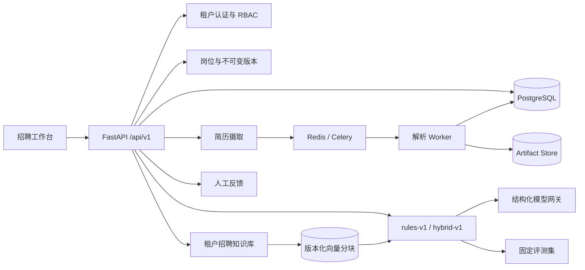

# RecruitMatch Copilot

面向企业招聘团队的多岗位智能推荐平台。招聘人员维护企业岗位库、上传候选人简历，系统解析技能与经验后推荐适合岗位 Top 3，并展示分维度评分、简历原文证据、缺失项和风险提示。招聘人员可以确认、驳回或改选岗位，反馈以追加记录进入后续评测。

> 系统只提供岗位适配建议，不自动录用或淘汰候选人；最终招聘决定由招聘人员作出。性别、年龄、照片、民族和婚育等敏感属性不进入匹配画像。

## 为什么它不是换皮聊天 Demo

- **真实业务闭环**：企业岗位版本 → 简历上传/解析 → Top 3 推荐 → 证据复核 → 人工反馈 → 离线评测。
- **多租户隔离**：JWT 中携带租户身份，仓储查询强制租户条件；跨租户资源 ID 统一返回 404。
- **有界混合匹配**：`rules-v1` 保持兼容；`hybrid-v1` 固定由 80% 规则分与最多 20% 语义项目分组成，语义分必须同时引用当前简历和岗位证据。
- **招聘 RAG**：企业制度、面试指南、能力模型和评分量表具备上传、去重、分块、版本化索引、重建和停用生命周期；检索先按租户过滤。
- **受约束模型层**：OpenAI-compatible 结构化输出、Schema 校验、超时/重试、Token/费用追踪；未知引用或无引用结论会被剔除，失败自动降级到规则结果。
- **可靠文件管线**：PDF、DOCX、TXT 白名单、10 MiB 限制、SHA-256 租户内幂等、UUID 物理路径、损坏文件稳定错误码。
- **异步生产形态**：API、Celery Worker、Redis、PostgreSQL 与 Alembic 迁移通过 Docker Compose 组装；测试使用 SQLite 和内联任务。
- **可重复 AI 评测**：提交 150 条确定性合成样本、生成脚本、评测脚本和机器可读结果，不手填指标。
- **运营可见性**：模型无关的 liveness/readiness、租户级业务统计、request ID 和不记录正文的审计日志。

## 当前可验证结果

规则和 AI 对比结果都由仓库脚本生成：

| 数据集 | 标签来源 | 样本 | Top-1 Accuracy | Top-3 Recall | 证据覆盖率 |
|---|---|---:|---:|---:|---:|
| recruitmatch-v1 | synthetic_heuristic | 150 | 98.67% | 100% | 100% |
| recruitmatch-ai-v1 / hybrid-v1 | synthetic_ai | 150 | 97.33% | 100% | 引用有效率 100% |

这些数字只表示对应算法在固定合成基准上的回归表现，不代表真实招聘准确率。真实上线前必须由招聘专家对脱敏样本重新标注并审查公平性。

复现：

```bash
python scripts/generate_recruitment_eval.py
python scripts/evaluate_recruitment.py
python scripts/evaluate_ai_pipeline.py --mode hybrid-v1 --fake-model
```

## 架构



采用模块化单体而非为了展示而拆微服务。领域服务依赖仓储和任务接口，测试可替换基础设施；后续只有在吞吐或团队边界真正需要时才拆分。

详细设计见 [docs/architecture.md](docs/architecture.md)，业务规格见 [RecruitMatch Copilot 设计](docs/superpowers/specs/2026-08-19-recruitmatch-copilot-design.md)，AI/RAG 边界见 [AI Layer 设计](docs/superpowers/specs/2026-08-19-recruitmatch-ai-layer-design.md)。

## 快速启动

### Docker Compose

```bash
cp .env.example .env
# 修改 JWT_SECRET；默认 AI_ENABLED=false，无需模型 Key
docker compose up --build
```

访问：

- 招聘工作台：<http://localhost:8000>
- OpenAPI：<http://localhost:8000/docs>
- 就绪检查：<http://localhost:8000/api/v1/health/ready>

首次进入工作台选择“创建企业空间”。Compose 启动时会自动执行迁移并初始化 10 个岗位族 × 3 个级别，共 30 个岗位模板。

### 本地开发

```bash
python3 -m venv .venv
source .venv/bin/activate
pip install -r requirements.txt
export JWT_SECRET='replace-with-at-least-32-random-bytes'
alembic upgrade head
python scripts/seed_job_templates.py
uvicorn app.main:app --reload
```

默认数据库为 `data/recruitmatch.db`，任务以内联方式执行。生产式本地联调使用 Compose 的 PostgreSQL、Redis 和 Celery。

启用 AI 时配置：

```bash
export AI_ENABLED=true
export OPENAI_API_KEY='your-key'
export OPENAI_BASE_URL='https://api.deepseek.com'
export OPENAI_MODEL='deepseek-chat'
```

模型网关使用 OpenAI-compatible 协议，可替换为其他兼容供应商。未配置或调用失败时，健康检查、岗位管理、简历处理和 `rules-v1` 仍可工作；`/api/v1/ai/status` 会显示降级状态。

## 关键 API

| 方法 | 路径 | 说明 |
|---|---|---|
| POST | `/api/v1/auth/bootstrap` | 创建企业及首位管理员 |
| POST | `/api/v1/auth/login` | 获取访问令牌 |
| GET | `/api/v1/job-templates` | 查看预置岗位模板 |
| POST/GET | `/api/v1/jobs` | 创建/查询企业岗位 |
| PUT | `/api/v1/jobs/{id}` | 追加不可变岗位版本 |
| POST | `/api/v1/jobs/{id}/activate` | 发布岗位 |
| POST/GET | `/api/v1/resumes` | 上传/查询简历 |
| POST | `/api/v1/resumes/{id}/matches?mode=rules-v1\|hybrid-v1` | 生成 Top 3 推荐 |
| POST/GET | `/api/v1/knowledge-documents` | 上传/查询招聘知识 |
| POST | `/api/v1/knowledge-documents/{id}/reindex` | 重建知识索引 |
| POST | `/api/v1/knowledge-documents/{id}/deactivate` | 停用知识文档 |
| POST | `/api/v1/knowledge-documents/rebuild-sources` | 为旧简历和岗位版本补建语义索引 |
| GET | `/api/v1/ai/status` | 查看模型、Embedding 与降级状态 |
| GET | `/api/v1/evaluations/summary` | 查看当前租户的脱敏评测摘要与失败分类 |
| GET | `/api/v1/match-runs/{id}` | 查询版本化结果 |
| POST | `/api/v1/match-results/{id}/feedback` | 确认、驳回或改选 |
| GET | `/api/v1/analytics/summary` | 租户级业务统计 |

## 测试与质量门禁

```bash
python -m pytest -q
python -m ruff check app tests scripts
DATABASE_URL=sqlite:////tmp/recruitmatch-ci.db alembic upgrade head
python scripts/evaluate_ai_pipeline.py --mode hybrid-v1 --fake-model
```

测试覆盖：密码/JWT、岗位版本、租户 IDOR、上传幂等、文件安全、PDF/DOCX 错误、画像证据、状态机、Top 3 算法、反馈、运营统计、迁移和 Web 入口。GitHub Actions 会执行 Ruff、全新数据库迁移、合成数据生成、评测和全量测试。

## 安全与公平边界

- Argon2 密码摘要，短期 JWT，角色与租户来自已验证令牌。
- 文件名不参与物理路径；扩展名、MIME、大小和解析异常均在边界校验。
- 审计记录只包含用户/租户、请求路径、状态和耗时，不记录简历正文或令牌。
- 匹配画像没有性别、年龄、照片、民族、婚育字段；未知信息标为待确认。
- 结果使用“适配建议”而不是“录用/淘汰”，人工反馈不覆盖历史推荐。

## 已知限制

- 当前基准是合成数据，不是招聘专家标注的真实数据。
- RAG/LLM 增强只有合成回归结果，尚未经过招聘专家标注的真实数据验证。
- 当前向量适配器将分块向量持久化在关系库 JSON 字段，规模扩大后应替换为 pgvector 或专用向量库。
- 本地 Artifact Store 通过接口封装，但 S3/MinIO 适配器尚未实现。
- JWT 暂未实现刷新令牌撤销列表，企业 SSO 尚未实现。
- 预置模板以技术岗位为主，不能直接用于医疗、法律等专业招聘。

旧版通用 RAG 路由保留为兼容模块，默认不初始化；只有设置 `LEGACY_RAG_ENABLED=true` 时才加载旧 Embedding/Agent。

## 简历材料

可验证的项目描述、面试讲解顺序和禁止夸大的边界见 [docs/resume-bullets.md](docs/resume-bullets.md)。
